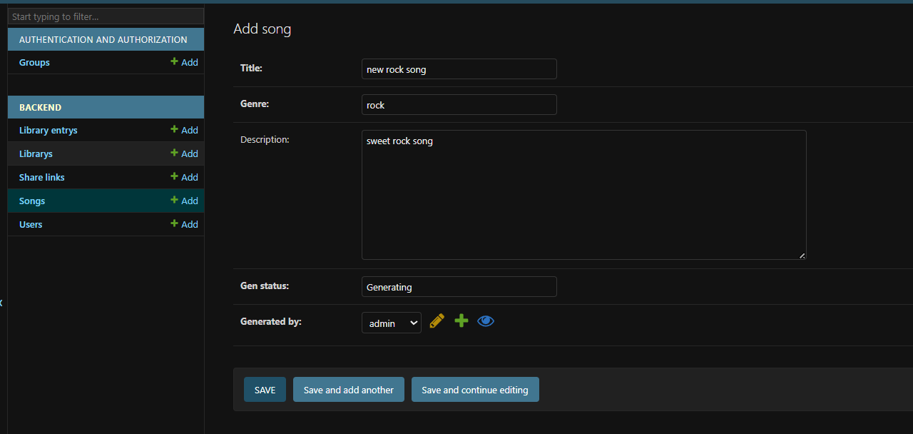
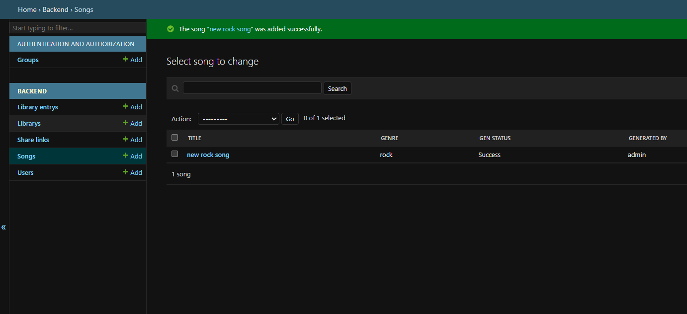
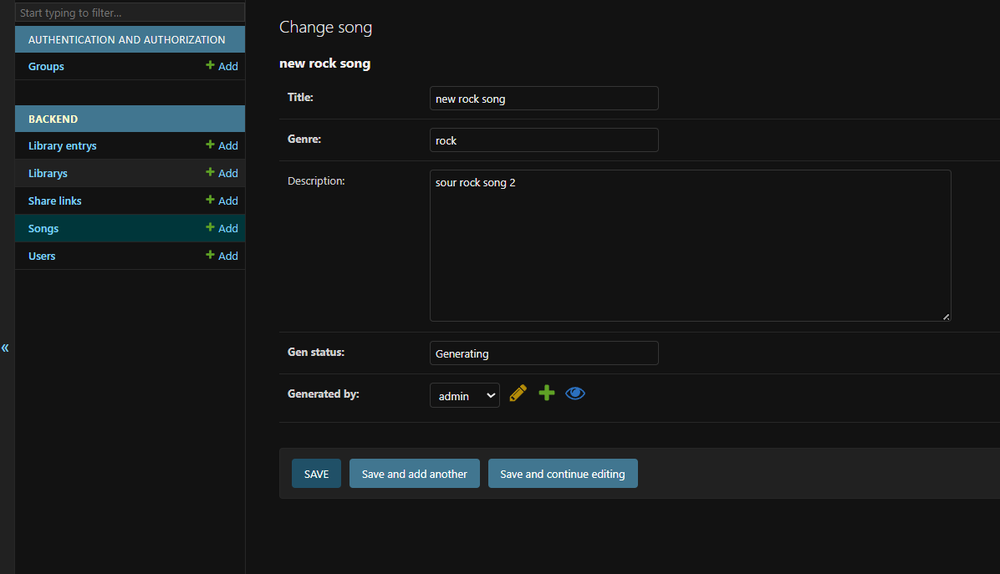
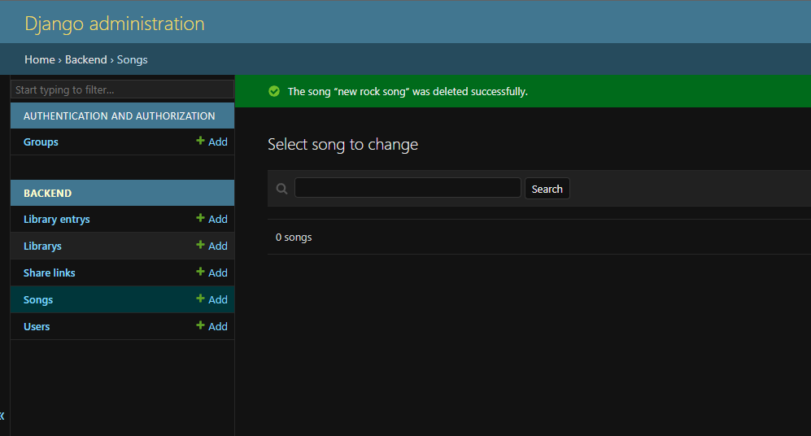

# Chithara AI Music Generator - Web Application

This repository contains the fully built, consolidated web application for the Chithara AI Music Generator. It is cleanly separated into two distinct Django apps: `frontend` (managing templates, UI, and views) and `backend` (managing all database models and schemas).

## Project Setup

### Prerequisites
- Python 3.10+
- Django 5.2+

### Quickstart Guide
1. Clone or download the repository and navigate to the root directory.
2. (Optional but recommended) Create and activate a virtual Python environment:
   ```bash
   python -m venv venv
   # On Windows: venv\Scripts\activate
   # On Mac/Linux: source venv/bin/activate
   ```
3. Install Django:
   ```bash
   pip install django
   ```
4. Run the database migrations to build your SQLite environment locally (vital for the custom User model structure):
   ```bash
   python manage.py makemigrations
   python manage.py migrate
   ```
5. Create an administrative superuser account (if you haven't used the automated injection script):
   ```bash
   python manage.py createsuperuser
   ```
6. Start the development server:
   ```bash
   python manage.py runserver
   ```
7. Open a web browser:
   - Django Admin Registry (only adming implimented as of now): `http://127.0.0.1:8000/admin/`

## Architecture Structure

This project completely drops monolithic structures by separating logic into two core scalable systems:

- **`backend`**: Houses all database modeling via an `api/models/` folder. Contains schemas for `user_model.py`, `song_model.py`, `library_model.py`, and `share_model.py`. The Django Admin interface is explicitly registered to expose all these nested attributes.
- **`frontend`**: Manages the CRUD (Create, Read, Update, Delete) interfaces dynamically. Contains `views.py` handling form processing logic, `urls.py` managing all interaction routes, and `templates/frontend/` presenting the Tailwind-styled HTML views securely.

## Core Models

- **`User`**: Base profile extending the custom user matrix. Holds many-to-many relationship mappings to track a `listens_to` history. Replaces the older separate Artist/Enjoyer paradigms so anyone can act as a creator.
- **`Song`**: The core data object tied directly to the `User` framework who generated it. 
- **`Library` & `LibraryEntry`**: Holds discrete junction tracking connecting individual User libraries cleanly to specific tracks.
- **`ShareLink`**: External links carrying specific user permissions for shared interactions.

## CRUD Operations

CREATE


READ


UPDATE


DELETE
