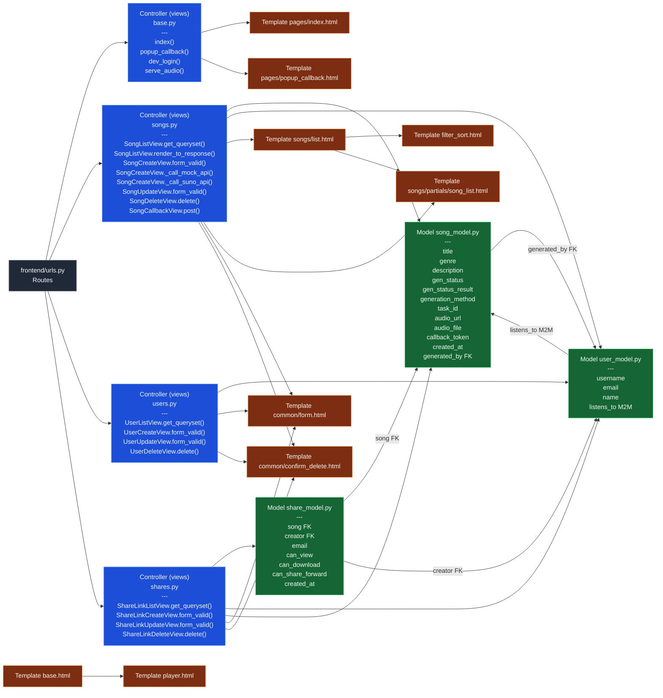
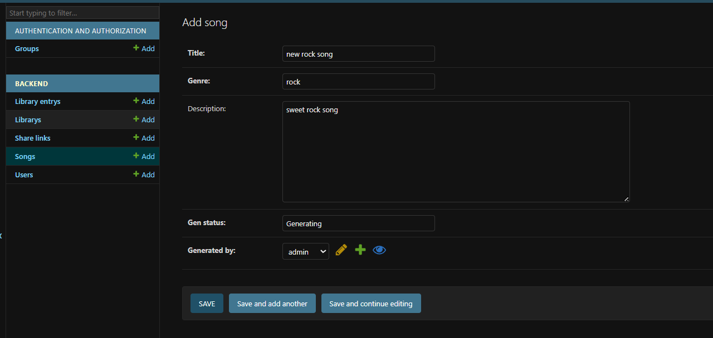
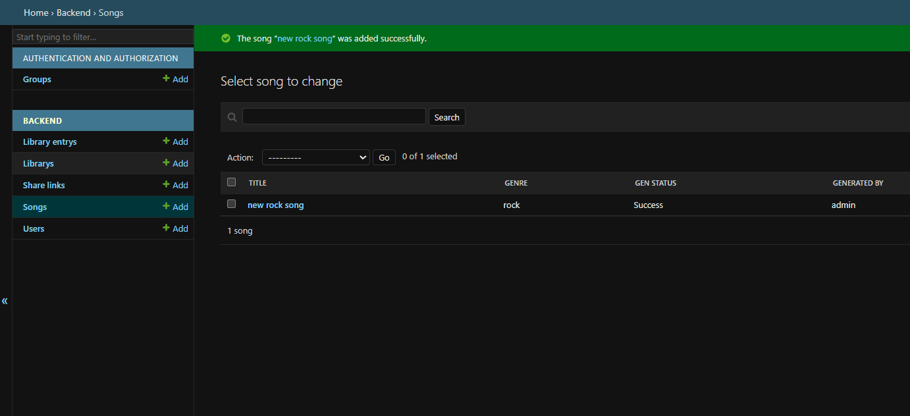
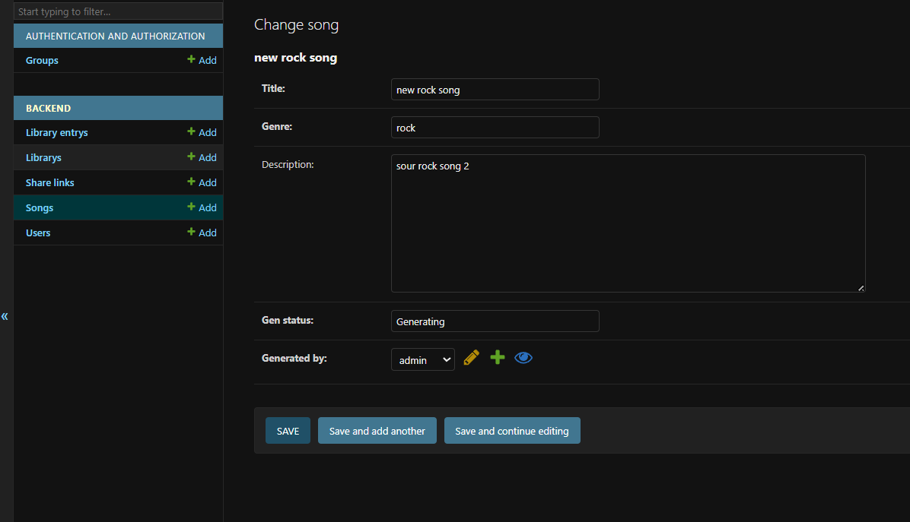
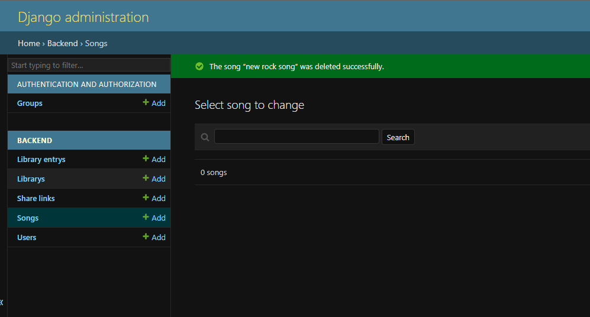

# Chithara AI Music Generator - Web Application

This repository contains the fully built, consolidated web application for the Chithara AI Music Generator. It is cleanly separated into two distinct Django apps: `frontend` (managing templates, UI, and views) and `backend` (managing all database models and schemas).

admin url

features:
- User Authentication via Google OAuth
- Developer Bypass for instant login and testing (TA please use this one)
- Polymorphic Song Generation with support for multiple APIs (currently Suno API) and MOCK mode for testing without API calls (set during song generation)
- Song generation polled every 10 seconds to check for completion and log updates in terminal (check terminal for progress)
- Pseudo random gredient for song based on id for unique visual
- song player with real-time visualizer
- CRUD operations for songs with dynamic search and sorting capabilities
- 

TODO:
- Shareable links with granular permissions (view, download, share forward)
- Libary of songs shared by other users.
## Project Setup

### Prerequisites
- Python 3.10+
- Django 5.2 (LTS)
- MongoDB Database (running locally at `localhost:27017` or configured in settings)

### Quickstart Guide
1. Clone or download the repository and navigate to the root directory.
2. (Optional but recommended) Create and activate a virtual Python environment:
   ```bash
   python -m venv venv
   # On Windows: venv\Scripts\activate
   # On Mac/Linux: source venv/bin/activate
   ```
3. Install the required dependencies:
   ```bash
   pip install -r requirements.txt
   ```
4. **Environment Configuration**:
   - Rename `.env.example` (if provided) or create a file named `.env` in the root directory.
   - Add your Suno API token: `SUNO_API_TOKEN=your_token_here`
   - The MOCK/API stradegy is set in application when generating songs to support mulitple apis in the future.
5. Run the database migrations:
   ```bash
   python manage.py migrate
   ```
6. **Testing & Development**:
   - **Developer Bypass**: On the home page, you can use the "Developer Bypass" link to instantly log in as a test user (`testuser`) without needing Google OAuth setup.
7. Start the development server:
   ```bash
   python manage.py runserver
   ```
8. **Google OAuth Setup** (For official production login):
   - Go to [Google Cloud Console](https://console.cloud.google.com/) → APIs & Services → Credentials → Create OAuth 2.0 Client ID (Web application).
   - Under **Authorized redirect URIs**, add exactly: `http://127.0.0.1:8000/accounts/google/login/callback/`
   - Copy the `client_id` and `secret` into `config/settings.py` under `SOCIALACCOUNT_PROVIDERS`.
9. Open a web browser:
   - Dashboard & App UI: `http://127.0.0.1:8000/`
   - Django Admin: `http://127.0.0.1:8000/admin/`

## Architecture Structure

This project completely drops monolithic structures by separating logic into two core scalable systems:

- **`backend`**: Houses all database modeling via an `api/models/` folder. Contains schemas for `user_model.py`, `song_model.py`, and `share_model.py`. The Django Admin interface is explicitly registered to expose all these nested attributes.
- **`frontend`**: Manages the CRUD (Create, Read, Update, Delete) interfaces dynamically. Contains `views.py` handling form processing logic, `urls.py` managing all interaction routes, and `templates/frontend/` presenting the Tailwind-styled HTML views securely.

## Core Models

- **`User`**: Base profile extending the custom user matrix. Holds many-to-many relationship mappings to track a `listens_to` history. Replaces the older separate Artist/Enjoyer paradigms so anyone can act as a creator.
- **`Song`**: The core data object tied directly to the `User` framework who generated it. Includes metadata like tags, genre, description, and status.
- **`ShareLink`**: External links carrying specific user permissions (view, download, share forward) for shared interactions.

## MVC / MVT Diagram


```mermaid
flowchart LR
   %% Route Layer
   U["frontend/urls.py<br/>Routes"]

   %% View/Controller Layer
   VB["Controller (views)<br/>base.py<br/>---<br/>index()<br/>popup_callback()<br/>dev_login()<br/>serve_audio()"]
   VS["Controller (views)<br/>songs.py<br/>---<br/>SongListView.get_queryset()<br/>SongListView.render_to_response()<br/>SongCreateView.form_valid()<br/>SongCreateView._call_mock_api()<br/>SongCreateView._call_suno_api()<br/>SongUpdateView.form_valid()<br/>SongDeleteView.delete()<br/>SongCallbackView.post()"]
   VU["Controller (views)<br/>users.py<br/>---<br/>UserListView.get_queryset()<br/>UserCreateView.form_valid()<br/>UserUpdateView.form_valid()<br/>UserDeleteView.delete()"]
   VSH["Controller (views)<br/>shares.py<br/>---<br/>ShareLinkListView.get_queryset()<br/>ShareLinkCreateView.form_valid()<br/>ShareLinkUpdateView.form_valid()<br/>ShareLinkDeleteView.delete()"]

   %% Model Layer
   MU["Model user_model.py<br/>---<br/>username<br/>email<br/>name<br/>listens_to M2M"]
   MS["Model song_model.py<br/>---<br/>title<br/>genre<br/>description<br/>gen_status<br/>gen_status_result<br/>generation_method<br/>task_id<br/>audio_url<br/>audio_file<br/>callback_token<br/>created_at<br/>generated_by FK"]
   MSL["Model share_model.py<br/>---<br/>song FK<br/>creator FK<br/>email<br/>can_view<br/>can_download<br/>can_share_forward<br/>created_at"]

   %% Template Layer
   TB["Template base.html"]
   TP["Template player.html"]
   TF["Template filter_sort.html"]
   TL["Template songs/list.html"]
   TLP["Template songs/partials/song_list.html"]
   TFORM["Template common/form.html"]
   TCONF["Template common/confirm_delete.html"]
   TINDEX["Template pages/index.html"]
   TPOP["Template pages/popup_callback.html"]

   %% Route to views
   U --> VB
   U --> VS
   U --> VU
   U --> VSH

   %% View to models
   VS --> MS
   VS --> MU
   VU --> MU
   VSH --> MSL
   VSH --> MU
   VSH --> MS

   %% Model relations
   MU -->|listens_to M2M| MS
   MS -->|generated_by FK| MU
   MSL -->|song FK| MS
   MSL -->|creator FK| MU

   %% View to templates
   VB --> TINDEX
   VB --> TPOP
   VS --> TL
   VS --> TLP
   VS --> TFORM
   VS --> TCONF
   VU --> TFORM
   VU --> TCONF
   VSH --> TFORM
   VSH --> TCONF

   %% Template composition
   TL --> TF
   TL --> TLP
   TB --> TP

   %% Color coding: M / V / T (+ routes)
   classDef route fill:#1f2937,stroke:#9ca3af,color:#f9fafb,stroke-width:1px;
   classDef view fill:#1d4ed8,stroke:#93c5fd,color:#eff6ff,stroke-width:1px;
   classDef model fill:#166534,stroke:#86efac,color:#f0fdf4,stroke-width:1px;
   classDef template fill:#7c2d12,stroke:#fdba74,color:#fff7ed,stroke-width:1px;

   class U route;
   class VB,VS,VU,VSH view;
   class MU,MS,MSL model;
   class TB,TP,TF,TL,TLP,TFORM,TCONF,TINDEX,TPOP template;
```

## CRUD Operations

CREATE


READ


UPDATE


DELETE
