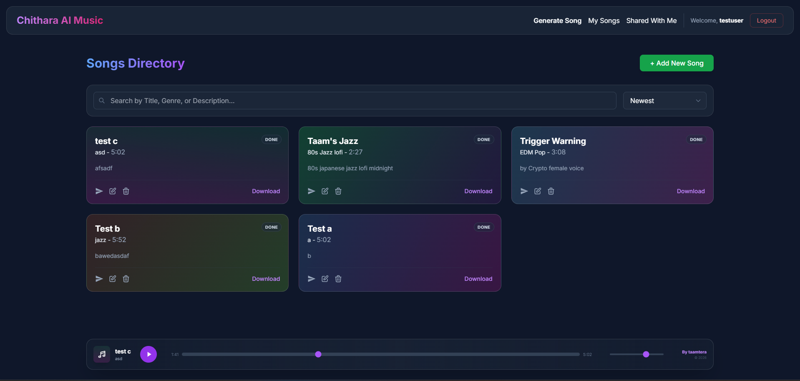
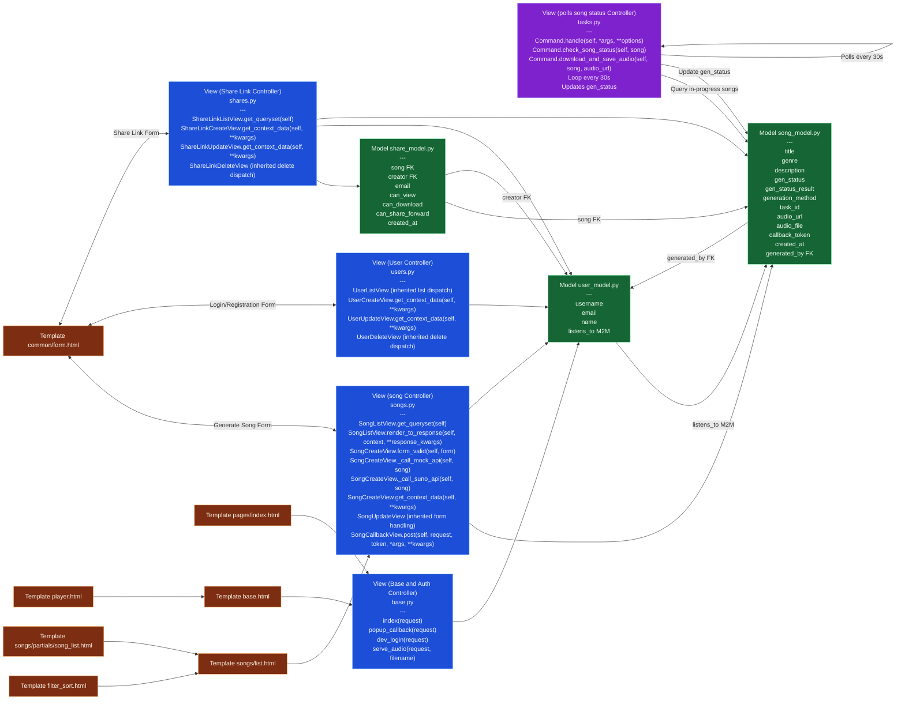
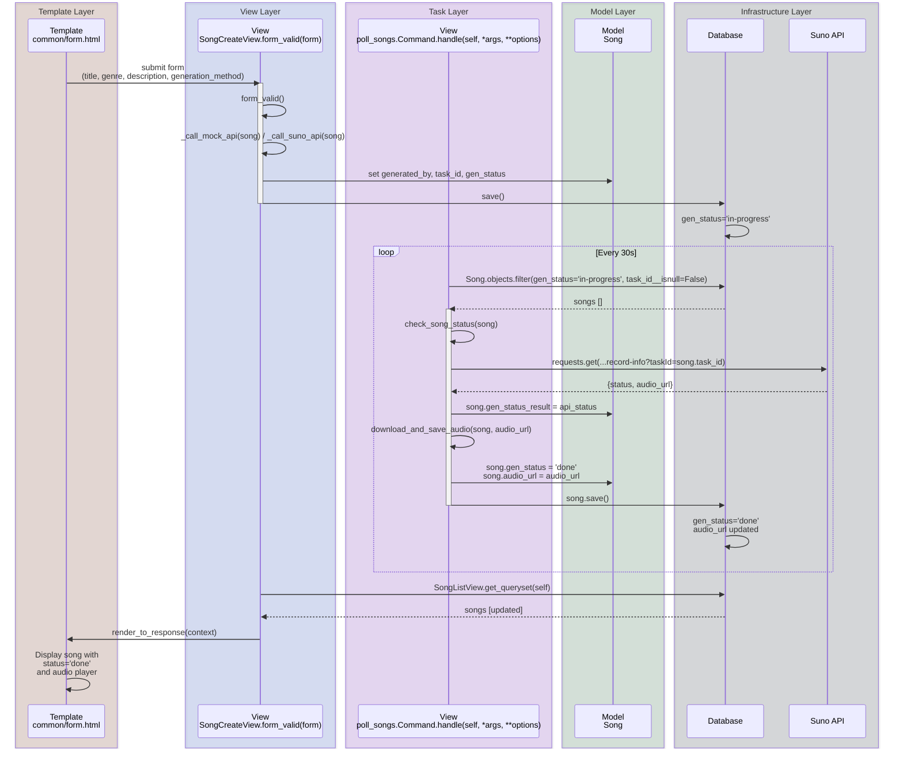

## Introduction

Chithara AI Music Generator is a web application that allows users to generate, manage, and play AI-created music tracks. It supports both real API-based generation (Suno) and a mock mode for fast testing, enabling a smooth development and demonstration experience. Users can build a personal music library, search and sort songs dynamically, and play tracks with a real-time visualizer, all within a responsive and modern interface.

features:
- User Authentication via Google OAuth
- Developer Bypass for instant login and testing (TA please use this one)
- Polymorphic Song Generation with support for multiple APIs (currently Suno API) and MOCK mode for testing without API calls (set during song generation)
- MOCK mode simulates in-progress processing with a 10-second delay before marking the song done
- SUNO MODE Song generation polled every 10 seconds to check for completion and log updates in terminal (check terminal for progress)
- Pseudo random gredient for song based on id for unique visual
- Persistent song playback with real-time visualizer
- CRUD operations for songs with dynamic search and sorting capabilities

TODO:
- Shareable links with granular permissions (view, download, share forward)
- Libary of songs shared by other users.
## Project Setup

### Prerequisites
- Python 3.10+
- Django 5.2 (LTS)
- MongoDB Database (Default: `localhost:27017` no credentials or configured in config/settings.py)

### Quickstart Guide
1. Clone or download the repository and navigate to the root directory.
2. (Optional but recommended) Create and activate a virtual Python environment:
   ```bash
   python -m venv venv
   # On Windows: venv\Scripts\activate
   # On Mac/Linux: source venv/bin/activate
   ```
3. Install the required dependencies:
   ```bash
   pip install -r requirements.txt
   ```
4. **Environment Configuration**:
   - Rename `.env.example` (if provided) or create a file named `.env` in the root directory.
   - Add your Suno API token: `SUNO_API_TOKEN=your_token_here`
   - The MOCK/API stradegy is set in application when generating songs to support mulitple apis in the future.
5. Run the database migrations:
   ```bash
   python manage.py migrate
   ```
6. **Testing & Development**:
   - **Developer Bypass**: On the home page, you can use the "Developer Bypass" link to instantly log in as a test user (`testuser`) without needing Google OAuth setup.
7. Start the development server:
   ```bash
   python manage.py runserver
   ```
8. **Google OAuth Setup** (❗OPTIONAL USE DEVELOPER BYPASS FOR TA TESTING❗):
   - Go to [Google Cloud Console](https://console.cloud.google.com/) → APIs & Services → Credentials → Create OAuth 2.0 Client ID (Web application).
   - Under **Authorized redirect URIs**, add exactly: `http://127.0.0.1:8000/accounts/google/login/callback/`
   - Copy the `client_id` and `secret` into `config/settings.py` under `SOCIALACCOUNT_PROVIDERS`.
9. Open a web browser:
   - Dashboard & App UI: `http://127.0.0.1:8000/`
   - Django Admin: `http://127.0.0.1:8000/admin/`

## Architecture Structure

The project is separated into two Django apps with clear responsibilities:

- **`backend`**: Owns the data layer. It contains the core database models such as `User`, `Song`, and `ShareLink`. These models define user libraries, generated songs, saved audio files, generation status, and future sharing permissions.

- **`frontend`**: Owns the application interface and user-facing logic. It contains views, routes, templates, reusable UI components, and the song CRUD workflow. This includes song creation, update, deletion, library display, AJAX search/sort, the footer audio player, and the real-time visualizer.

- **Management command / polling service**: A Django management command polls songs with `gen_status='in-progress'`. For Suno songs, it calls the Suno API and downloads the finished audio. For MOCK songs, it skips the external API, downloads the predefined mock audio URL, saves it into `audio_file`, and marks the song as done.

- **Template composition**: The UI is split into reusable templates. `songs/list.html` renders the page shell, `components/filter_sort.html` handles filtering and sorting, and `songs/partials/song_list.html` renders only the song grid so AJAX can update the list without refreshing the full page.

- **Audio playback layer**: The shared footer player is included globally and uses the selected song’s `audio_file` or `audio_url`. The visualizer is separated into its own component and connects to the audio element through the Web Audio API.

## Core Models

- **`User`**: Represents an authenticated application user. A user can generate songs and maintain a personal song library through the `listens_to` many-to-many relationship. This supports the current design where a user can act as both creator and listener.

- **`Song`**: The central music object. It stores song metadata such as `title`, `genre`, and `description`, along with generation fields such as `generation_method`, `task_id`, `gen_status`, and `gen_status_result`.

  The song supports both external API generation and MOCK generation:

  - `generation_method='suno'`: The polling service checks Suno using `task_id`, reads the API status, downloads the completed audio, saves it into `audio_file`, and marks the song as `done`.
  - `generation_method='mock'`: The polling service skips the Suno API, downloads the predefined `audio_url`, saves it into `audio_file`, and marks the song as `done`.

  The model also keeps both:
  - `audio_url`: the original remote audio source
  - `audio_file`: the locally saved/downloaded audio file used by the app player

- **`ShareLink`**: Planned sharing model for external access. It links a song to a creator and stores permission flags such as `can_view`, `can_download`, and `can_share_forward`. This supports the future shareable-link feature.

## MVC / MVT Diagram


```mermaid
flowchart LR

   %% View/View Layer
   VB["View (Base and Auth Controller)<br/>base.py<br/>---<br/>index(request)<br/>popup_callback(request)<br/>dev_login(request)<br/>serve_audio(request, filename)"]
   VS["View (song Controller)<br/>songs.py<br/>---<br/>SongListView.get_queryset(self)<br/>SongListView.render_to_response(self, context, **response_kwargs)<br/>SongCreateView.form_valid(self, form)<br/>SongCreateView._call_mock_api(self, song)<br/>SongCreateView._call_suno_api(self, song)<br/>SongCreateView.get_context_data(self, **kwargs)<br/>SongUpdateView (inherited form handling)<br/>SongCallbackView.post(self, request, token, *args, **kwargs)"]
   VU["View (User Controller)<br/>users.py<br/>---<br/>UserListView (inherited list dispatch)<br/>UserCreateView.get_context_data(self, **kwargs)<br/>UserUpdateView.get_context_data(self, **kwargs)<br/>UserDeleteView (inherited delete dispatch)"]
   VSH["View (Share Link Controller)<br/>shares.py<br/>---<br/>ShareLinkListView.get_queryset(self)<br/>ShareLinkCreateView.get_context_data(self, **kwargs)<br/>ShareLinkUpdateView.get_context_data(self, **kwargs)<br/>ShareLinkDeleteView (inherited delete dispatch)"]
   VT["View (polls song status Controller)<br/>tasks.py<br/>---<br/>Command.handle(self, *args, **options)<br/>Command.check_song_status(self, song)<br/>Command.download_and_save_audio(self, song, audio_url)<br/>Loop every 30s<br/>Updates gen_status"]

   %% Model Layer
   MU["Model user_model.py<br/>---<br/>username<br/>email<br/>name<br/>listens_to M2M"]
   MS["Model song_model.py<br/>---<br/>title<br/>genre<br/>description<br/>gen_status<br/>gen_status_result<br/>generation_method<br/>task_id<br/>audio_url<br/>audio_file<br/>callback_token<br/>created_at<br/>generated_by FK"]
   MSL["Model share_model.py<br/>---<br/>song FK<br/>creator FK<br/>email<br/>can_view<br/>can_download<br/>can_share_forward<br/>created_at"]

   %% Template Layer
   TB["Template base.html"]
   TP["Template player.html"]
   TF["Template filter_sort.html"]
   TL["Template songs/list.html"]
   TLP["Template songs/partials/song_list.html"]
   TFORM["Template common/form.html"]
   TINDEX["Template pages/index.html"]

   %% View to models
   VB --> MU
   VS --> MS
   VS --> MU
   VU --> MU
   VSH --> MSL
   VSH --> MU
   VSH --> MS
   VT -->|Query in-progress songs| MS
   VT -->|Update gen_status| MS
   VT -->|Polls every 30s| VT

   %% Model relations
   MU -->|listens_to M2M| MS
   MS -->|generated_by FK| MU
   MSL -->|song FK| MS
   MSL -->|creator FK| MU

   %% Template to views
   TL --> VS
   TINDEX --> VB 
   TB --> VB  
   TFORM <--> |Generate Song Form| VS 
   TFORM <--> |Login/Registration Form| VU 
   TFORM <--> |Share Link Form| VSH 

   %% Template composition
   TF --> TL
   TLP --> TL
   TP --> TB  

   %% Color coding: M / V / T (+ routes)
   classDef route fill:#1f2937,stroke:#9ca3af,color:#f9fafb,stroke-width:1px;
   classDef view fill:#1d4ed8,stroke:#93c5fd,color:#eff6ff,stroke-width:1px;
   classDef task fill:#7e22ce,stroke:#c4b5fd,color:#f3e8ff,stroke-width:1px;
   classDef model fill:#166534,stroke:#86efac,color:#f0fdf4,stroke-width:1px;
   classDef template fill:#7c2d12,stroke:#fdba74,color:#fff7ed,stroke-width:1px;

   class VB,VS,VU,VSH view;
   class MU,MS,MSL model;
   class TB,TP,TF,TL,TLP,TFORM,TINDEX template;
   class VT task;
```

## Song Generation Sequence


```mermaid
sequenceDiagram
   box rgba(124,45,18,0.15) Template Layer
      participant Template as Template<br/>common/form.html
   end
   box rgba(29,78,216,0.15) View Layer
      participant SongView as View<br/>SongCreateView.form_valid(form)
   end
   box rgba(126,34,206,0.15) Task Layer
      participant TasksView as View<br/>poll_songs.Command.handle(self, *args, **options)
   end
   box rgba(22,101,52,0.15) Model Layer
      participant SongModel as Model<br/>Song
   end
   box rgba(31,41,55,0.15) Infrastructure Layer
      participant DB as Database
      participant SunoAPI as Suno API
   end

   Template->>SongView: submit form<br/>(title, genre, description, generation_method)
    activate SongView
    SongView->>SongView: form_valid()
   SongView->>SongView: _call_mock_api(song) / _call_suno_api(song)
   SongView->>SongModel: set generated_by, task_id, gen_status
   SongView->>DB: save()
    deactivate SongView
    DB->>DB: gen_status='in-progress'

    loop Every 30s
      TasksView->>DB: Song.objects.filter(gen_status='in-progress', task_id__isnull=False)
        DB-->>TasksView: songs []
        activate TasksView
        TasksView->>TasksView: check_song_status(song)
      TasksView->>SunoAPI: requests.get(...record-info?taskId=song.task_id)
        SunoAPI-->>TasksView: {status, audio_url}
        TasksView->>SongModel: song.gen_status_result = api_status
      TasksView->>TasksView: download_and_save_audio(song, audio_url)
      TasksView->>SongModel: song.gen_status = 'done'<br/>song.audio_url = audio_url
      TasksView->>DB: song.save()
        deactivate TasksView
        DB->>DB: gen_status='done'<br/>audio_url updated
    end

   SongView->>DB: SongListView.get_queryset(self)
    DB-->>SongView: songs [updated]
   SongView->>Template: render_to_response(context)
    Template->>Template: Display song with<br/>status='done'<br/>and audio player
```

   ## Mock Song Generation Sequence

   ```mermaid
   sequenceDiagram
      box rgba(124,45,18,0.15) Template Layer
         participant Template as Template<br/>common/form.html
      end
      box rgba(29,78,216,0.15) View Layer
         participant SongView as View<br/>SongCreateView.form_valid(form)
      end
      box rgba(126,34,206,0.15) Task Layer
         participant TasksView as View<br/>poll_songs.Command.check_song_status(song)
      end
      box rgba(22,101,52,0.15) Model Layer
         participant SongModel as Model<br/>Song
      end
      box rgba(31,41,55,0.15) Infrastructure Layer
         participant DB as Database
      end

      Template->>SongView: submit form<br/>(title, genre, description, generation_method='mock')
      activate SongView
      SongView->>SongView: form_valid(form)
      SongView->>SongView: _call_mock_api(song)
      SongView->>SongModel: set generated_by, task_id, gen_status='in-progress', audio_url=fixed link
      SongView->>DB: save()
      deactivate SongView
      DB->>DB: gen_status='in-progress'<br/>audio_url=fixed link

      SongView->>TasksView: trigger single poll update
      activate TasksView
      TasksView->>TasksView: wait 10 seconds
      TasksView->>SongModel: set gen_status='done'<br/>audio_url=fixed link
      TasksView->>DB: song.save()
      deactivate TasksView

      SongView->>DB: SongListView.get_queryset(self)
      DB-->>SongView: songs [updated]
      SongView->>Template: render_to_response(context)
      Template->>Template: Display song with<br/>status='done'<br/>and audio player
   ```


## CRUD Operations

CREATE


READ


UPDATE


DELETE
